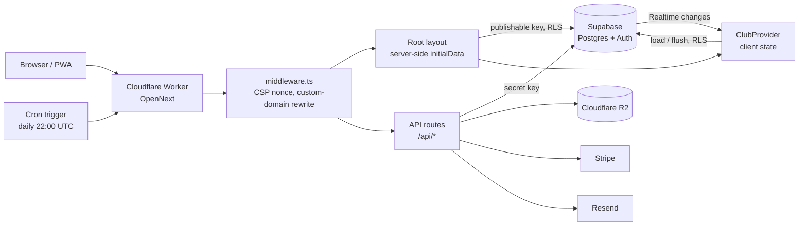

# itsfootball.club

A multi-tenant platform for grassroots football clubs. Anyone can sign up, create a club and get a
complete club website with a live match center, member passes, tournaments, payments and an admin
portal. Each club gets its own branded pages at `itsfootball.club/{club}`, and can also run them on
its own domain.

Built with **Next.js 15 (App Router) + React 19**, **Supabase** (Postgres, Auth, Realtime, Storage),
**Cloudflare Workers** (via OpenNext), **Cloudflare R2**, **Stripe Connect**, **Resend** and Web Push.

---

## Contents

- [Features](#features)
- [Tech stack](#tech-stack)
- [Getting started](#getting-started)
- [Environment variables](#environment-variables)
- [Architecture](#architecture)
- [Security model](#security-model)
- [Project structure](#project-structure)
- [Testing and quality checks](#testing-and-quality-checks)
- [Deployment](#deployment)
- [Further documentation](#further-documentation)

---

## Features

### Club public website (`/{club}`)
- Hero slider showing pinned matches, events, news and gallery items
- Fixtures and results, a squad roster with player stats and a leaderboard, and the executive committee
- News articles with a rich-text editor, images and video embeds, plus a media gallery
- Home ground details with an embedded map, and a contact form that lands in the admin inbox
- Sponsor showcase with tracked impressions and clicks per placement
- Per-club branding: colours, crest, short name and motto, applied as CSS variables with a WCAG contrast check

### Live match center (`/{club}/match/{id}`)
- Live scoreboard with a running clock derived from the referee's own clock state, so every viewer shows the same minute
- Goal celebrations (banner, confetti, optional sound), an event timeline, match statistics, and Player of the Match
- Read-only tactical pitch showing each club side's lineup
- Updates pushed in real time through Supabase Realtime
- Shareable matchday graphics (result or starting XI) for Instagram and WhatsApp
- Door QR check-in for spectators

### Tournaments
- Formats: **knockout**, **league** (round robin) and **group + knockout**, including a "Top 3" step-ladder playoff where 1st gets a bye to the final
- Seeding, byes, third-place match, penalties, automatic standings and bracket progression (`lib/tournament-engine.ts`)
- Internal teams (the club's own sides, each with a roster) and external teams
- Player of the Tournament award

### Members
- Self-service membership applications, approval workflow and membership tiers
- Virtual member pass with a unique QR code; admins verify members by scanning it
- One-time email sign-in for members, and a "claim my memberships" flow for existing records
- Availability RSVPs for matches through personal links or, signed in, from the club app, and a public matchday squad
- Membership renewal per club (Finance → Settings): year to year from the join date, or fiscal year to fiscal year from a chosen month
- Club app (`/{club}/app`, installable per club): what's coming up, your availability, your pass, and the admin tools your roles allow, with a phone tab bar across the club site
- ClubScore gamification: points for attendance, goals, assists, clean sheets and MOTM awards, with streaks, tiers and badges

### Admin portal (`/{club}/admin`)
- Dashboard, analytics (page views, gate scans, sponsor performance) and an inbox for messages and enquiries
- Match management and a live match-center controller (score, clock, events, MOTM)
- Lineup workbench (draft and publish lineups), availability tracking and training attendance
- Members, squad, executive committee, seasons, internal teams and tournaments
- Events with QR check-in, a camera QR scanner, and sponsors with a sponsor hub
- Content (news and gallery), hero slider and branding (including custom domain setup)
- Finance: income and expense ledger with receipts; merch shop; email notifications

### Payments and commerce
- Stripe Connect: each club connects its own Stripe account, and an optional platform booking fee is configurable
- Paid memberships, event tickets and merch shop orders; bank-transfer payments with receipt upload
- Ticket pages per order (`/{club}/tickets/{orderId}`)

### Communications
- Branded club emails through Resend: sign-in links, match/event/renewal reminders (daily cron) and admin-sent notices, with one-click unsubscribe
- Web push notifications to followers (PWA with a service worker and an offline page)
- Calendar feed of fixtures and events (`/{club}/calendar.ics`, subscribable via `webcal://`)

### Platform
- Club directory, club creation and "my clubs"
- Custom domains per club via Cloudflare for SaaS, with automatic certificates
- SEO: per-page metadata, JSON-LD structured data, sitemap, robots and `llms.txt`
- Light and dark themes, mobile-first layouts and reduced-motion support

---

## Tech stack

| Layer | Technology |
| --- | --- |
| Framework | Next.js 15 (App Router), React 19, TypeScript |
| Hosting | Cloudflare Workers via [`@opennextjs/cloudflare`](https://opennext.js.org/cloudflare) |
| Database and auth | Supabase: Postgres with Row Level Security, Auth, Realtime, Storage |
| File storage | Cloudflare R2 through the S3 API (falls back to Supabase Storage) |
| Payments | Stripe Connect |
| Email | Resend (including the Supabase Auth send-email hook) |
| Push | Web Push (VAPID) with a service worker |
| UI | Hand-written CSS (`app/globals.css`), `lucide-react` icons, `canvas-confetti`, `qrcode.react`, `html5-qrcode` |

---

## Getting started

### Prerequisites
- **Node.js 20+** and npm
- A **Supabase** project (the free tier is fine for development)
- Optional, depending on which features you need: Cloudflare R2, Stripe, Resend, and a Cloudflare account for deployment

### 1. Install

```bash
git clone <repo-url> itsfootball.club
cd itsfootball.club
npm install
```

### 2. Configure environment

```bash
cp .env.example .env.local
```

At minimum, fill in the Supabase values (`NEXT_PUBLIC_SUPABASE_URL`, `NEXT_PUBLIC_SUPABASE_PUBLISHABLE_KEY`
and `SUPABASE_SECRET_KEY`). Everything else enables optional features; see
[Environment variables](#environment-variables).

### 3. Set up the database

The schema lives in `supabase/migrations/`. Running every file **in filename order** builds a fresh
database. The migrations are written to be idempotent (`IF NOT EXISTS`, `DROP ... IF EXISTS`), so
re-running them is safe.

Use one of these:

- **Supabase SQL editor:** paste and run each file in order, starting with `20260918_base_schema.sql`.
- **psql** (connection string from Supabase → Project Settings → Database):

  ```bash
  for f in supabase/migrations/*.sql; do psql "$DATABASE_URL" -v ON_ERROR_STOP=1 -f "$f"; done
  ```

The migrations also create the Storage buckets (`club-assets` for public uploads and `receipts` for
private payment receipts), the RLS policies, the public-safe views and the Realtime publication.

### 4. Configure Supabase Auth

In Supabase → **Authentication → URL Configuration**, set the Site URL to your app's URL
(`http://localhost:3000` for local development) and add `http://localhost:3000/**` to Redirect URLs.

For local development, Supabase's built-in emails are enough. In production, switch on the
**Send Email hook** so sign-in emails are club-branded and sent through Resend; see
[docs/email.md](docs/email.md).

### 5. Run

```bash
npm run dev
```

Open <http://localhost:3000>, create an account and create your first club. Its public site is at
`/{your-club-slug}` and its admin portal is at `/{your-club-slug}/admin`.

---

## Environment variables

`.env.example` documents every variable. The table below shows which ones each feature needs.

| Variable | Needed for | Notes |
| --- | --- | --- |
| `NEXT_PUBLIC_SUPABASE_URL` | **Required** | Also scopes the Content Security Policy to your Supabase host |
| `NEXT_PUBLIC_SUPABASE_PUBLISHABLE_KEY` | **Required** | Browser-safe key. `NEXT_PUBLIC_SUPABASE_ANON_KEY` is accepted as a legacy fallback |
| `SUPABASE_SECRET_KEY` | **Required** for server routes | Server only, never exposed to the browser. Used by payments, uploads, webhooks, cron, email and push. `SUPABASE_SERVICE_ROLE_KEY` is a legacy fallback |
| `NEXT_PUBLIC_SITE_URL` | Self-hosting on another domain | Canonical platform URL; defaults to `https://itsfootball.club` |
| `R2_ACCOUNT_ID`, `R2_ACCESS_KEY_ID`, `R2_SECRET_ACCESS_KEY`, `R2_BUCKET_NAME`, `R2_PUBLIC_DOMAIN` | Image and video uploads on R2 | If unset, uploads go to the Supabase `club-assets` bucket |
| `R2_PRIVATE_BUCKET` | Private receipts on R2 | If unset, receipts go to the Supabase `receipts` bucket |
| `STRIPE_SECRET_KEY`, `STRIPE_CONNECT_WEBHOOK_SECRET` | Card payments | The Connect webhook points at `/api/stripe/webhook`; the required events are listed in `.env.example` |
| `NEXT_PUBLIC_BOOKING_FEE_PERCENT`, `_FLAT_CENTS`, `_MIN_CENTS` | Platform booking fee | Leave empty for no fee |
| `RESEND_API_KEY`, `EMAIL_FROM_ADDRESS`, `SEND_EMAIL_HOOK_SECRET`, `SUPPORT_EMAIL`, `EMAIL_TIMEZONE` | Email | See [docs/email.md](docs/email.md) |
| `CRON_SECRET` | Daily reminders and unsubscribe links | Long random string; changing it invalidates existing unsubscribe links |
| `CF_HOSTNAMES_TOKEN`, `CF_ZONE_ID` | Club custom domains | See [docs/custom-domains.md](docs/custom-domains.md) |
| `NEXT_PUBLIC_VAPID_PUBLIC_KEY`, `VAPID_PRIVATE_KEY`, `VAPID_SUBJECT` | Web push | Generate the pair once (command in `.env.example`); rotating it breaks every existing subscription |

> **Build-time values:** `NEXT_PUBLIC_*` variables, `R2_PUBLIC_DOMAIN` and the Supabase URL are baked
> into the build (the CSP is computed in `next.config.ts`). Rebuild and redeploy after changing them.

---

## Architecture

### Request flow



### Key design decisions

**Multi-tenancy by URL.** Every club lives under `/{clubSlug}`, and all tenant data carries a
`club_id`. `middleware.ts` maps a club's custom domain to its slug, with a 60-second per-isolate
cache, and rewrites `yourclub.com/member` to `/{slug}/member`. Platform-only pages on a club domain
redirect back to the main site. Old slugs keep working through `previous_slugs`.

**Server-rendered first paint, client-side state after.** For each request the root layout loads the
club's public data on the server (`lib/supabase/server-data.ts`, cached per request, with a 3-second
timeout). It passes that to `ClubProvider` as `initialData`, so pages render real content into the
first HTML for search engines and fast paints. In the browser, `lib/club-context.tsx` holds the app
state as in-memory arrays, caches it in `localStorage`, reloads from Supabase and subscribes to
Realtime changes.

**One sync engine for writes.** Pages edit state through context actions. `lib/supabase/sync.ts`
diffs the current arrays against what is known to be in the database, then upserts only the changed
columns, parents first. Rows are deleted only when deletion is explicitly requested. The column
whitelist is `lib/supabase/columns.ts`. Row Level Security decides what each user may actually write.

**Privileged work in API routes.** Anything that needs a secret runs in `app/api/*` with the Supabase
secret key, after checking the caller's session and role: payments, uploads, webhooks, emails, push,
custom domains and cron.

**Pure engines with self-checks.** Domain logic that is easy to get wrong lives in plain TypeScript
modules with runnable assertion files beside them, rather than inside components. Examples are the
tournament engine, finance, tickets, shop, slugs and push. See
[Testing and quality checks](#testing-and-quality-checks).

**Scheduled jobs.** `worker.ts` wraps the OpenNext worker and adds a Cloudflare cron trigger
(`wrangler.json`). Each day it calls `/api/cron/reminders`, authenticated with `CRON_SECRET`, to send
availability, event and renewal reminders. Each email is sent at most once (`email_log`).

### Roles

| Role | Can do |
| --- | --- |
| Owner (`clubs.owner_id`) | Everything for their club, including billing (Stripe Connect), custom domain and ownership-level settings |
| Club Admin (super user) | Every admin area, plus creating access roles, setting their permissions and deciding who holds them |
| Access roles (Treasurer, Manager, Youth Coach, Secretary, Welfare Officer, Media Officer, Commercial Officer, Volunteer, or the club's own) | The admin areas their role allows, each at view, edit (create and change) or full (also delete) |
| `player`, `member`, `supporter` | Member features: pass, availability, ClubScore. What they can see is limited by RLS |
| Visitor (signed out) | Public pages only, read through public-safe views |

Every club starts with the default access roles above (`club_access_roles`); a Club Admin edits them or
adds new ones on **Admin → Roles & Permissions**. A member holds a role by carrying its name as a squad
label (Squad & Players page), and several roles combine to the highest level per area. Only the Owner or
a Club Admin can give or remove access roles.

The UI hides admin pages by permission (`AdminGuard`, `useAuth().can`), but **the database is the
authority**: RLS policies use `has_club_perm(club_id, areas, level)`, and `is_club_admin(club_id)` for
super-user actions. Area keys live in `lib/permissions.ts`.

---

## Security model

- **Row Level Security on every table.** Public pages read sensitive tables only through public-safe
  views: `club_members_public` (no email, phone, date of birth or emergency contact),
  `player_availabilities_public` (only "available", without notes or response tokens) and `sponsors_public`.
- **Secrets stay on the server.** Only `NEXT_PUBLIC_*` values reach the browser. The Supabase secret
  key, Stripe, R2, Resend, VAPID and Cloudflare tokens are used only in API routes.
- **Strict CSP with a per-request nonce** (`middleware.ts` + `next.config.ts`): `'strict-dynamic'`
  scripts, allow-listed image, media and connect origins scoped to your own Supabase and R2,
  `frame-ancestors 'self'` and `object-src 'none'`. The site also sends `X-Frame-Options`,
  `X-Content-Type-Options`, `Referrer-Policy` and `Permissions-Policy`.
- **Verified webhooks.** Stripe signatures and the Supabase send-email hook signature are checked
  before acting. Unsubscribe links are HMAC-signed.
- **Upload validation.** File types are checked by their actual bytes (`lib/file-signature.ts`), not
  by the name or claimed type. Rich text is sanitised with DOMPurify.
- **Abuse limits.** API routes are rate-limited (`lib/rate-limit.ts`, best effort per isolate),
  backed by database-side limits on contact forms and analytics inserts.
- **Tenant isolation in the UI as well.** Pages only show records belonging to the club in the URL,
  never "the first club" or another club's cached data.

Report security issues privately to the maintainers rather than in a public issue.

---

## Project structure

```text
app/
  [clubSlug]/              Club site: home, match, events, tournaments, member, shop, tickets, ...
    admin/                 Club admin portal (one folder per section)
    @schema/               Parallel route that renders JSON-LD on the server
    calendar.ics/          Calendar feed
  api/                     Server routes (payments, upload, stripe, cron, email, push, custom-domain, ...)
  clubs/ create-club/ my-clubs/ faq/ auth/ unsubscribe/   Platform pages
  layout.tsx               Root layout: loads initialData, providers, fonts
  sitemap.ts robots.ts manifest.webmanifest/
components/                Shared UI (TacticalPitch, ScoreboardDigitRoll, VirtualPassCard, tournament/*, ...)
lib/
  club-context.tsx         Client app state, Realtime and cache (ClubProvider / useClub)
  auth-context.tsx         Supabase Auth session and per-club roles
  supabase/                Clients, sync engine, server data loader, types, column whitelist
  tournament-engine.ts     Fixtures, brackets, standings, match-side helpers
  email/ storage/          Resend templates and sender; R2 and receipts storage
  *.check.ts               Self-check scripts (see below)
supabase/migrations/       Database schema, RLS, views, functions (run in filename order)
public/                    Service worker, offline page, icons, llms.txt
docs/                      Setup guides for email and custom domains
middleware.ts              CSP nonce and custom-domain routing
worker.ts / wrangler.json  Cloudflare Worker entry and cron trigger
```

---

## Testing and quality checks

```bash
npm run check          # Runs every lib/*.check.ts self-check (tournament engine, finance, shop, tickets, ...)
npm run lint           # ESLint (next/core-web-vitals + next/typescript)
npx tsc --noEmit       # Type check
```

The `*.check.ts` files are small assertion scripts bundled with esbuild and run in Node, with no test
framework. When you change one of those modules, add a case to its check file. Run a single one with:

```bash
npx esbuild lib/tournament-engine.check.ts --bundle --platform=node --log-level=warning | node
```

UI changes should be checked in a browser at phone widths (320 and 360px) as well as on desktop, in
both light and dark themes.

---

## Deployment

The app is deployed to **Cloudflare Workers** with OpenNext.

```bash
npm run build:cloudflare      # next build + OpenNext transform into .open-next/
npx wrangler deploy           # deploys worker.ts with the assets and the cron trigger
```

1. **Build-time variables:** make the `NEXT_PUBLIC_*` values, `NEXT_PUBLIC_SUPABASE_URL` and
   `R2_PUBLIC_DOMAIN` available in the environment when you run the build.
2. **Runtime secrets:** set each server secret with `npx wrangler secret put NAME`. Plain variables
   added in the Cloudflare dashboard are wiped by the next `wrangler deploy`.
3. **Cron:** `wrangler.json` schedules `0 22 * * *` (UTC) for the daily reminders. Set `CRON_SECRET`.
4. **Stripe:** create a Connect webhook ("Events on connected accounts") pointing at
   `https://<your-domain>/api/stripe/webhook` with the events listed in `.env.example`.
5. **Email and custom domains:** follow [docs/email.md](docs/email.md) and
   [docs/custom-domains.md](docs/custom-domains.md).
6. **Database:** apply any new files in `supabase/migrations/` before deploying code that depends on them.

---

## Further documentation

| Document | What it covers |
| --- | --- |
| [docs/email.md](docs/email.md) | Resend domain verification, the Supabase send-email hook, reminders, unsubscribe |
| [docs/custom-domains.md](docs/custom-domains.md) | Cloudflare for SaaS setup and how club domains are routed and signed in |
| [.env.example](.env.example) | Every environment variable, with setup notes |
| [plans/](plans/README.md) | Implementation plans for UI and animation improvements |
| `graphify-out/` | Generated knowledge graph of the codebase (`graphify query "<question>"`); refresh with `graphify update .` |
